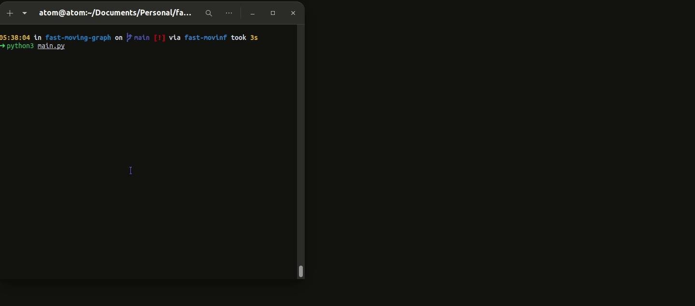

# Fast and Real Time Pyqt Graph

## Introduction

Developed this for internal data analysis of UHF RFID Tags at Ultimuslab.

### High FPS Multiple 1D Time Series Data Plotter


## INSTALLATION - LINUX
> Install Dependencies
```
git clone https://github.com/jenish-rudani/fast-moving-graph.git fastPyqtGraph && cd fastPyqtGraph

python3 -m pip install -r requirements.txt
```

## RUN
> Run the main script
```
python3 main.py
```


